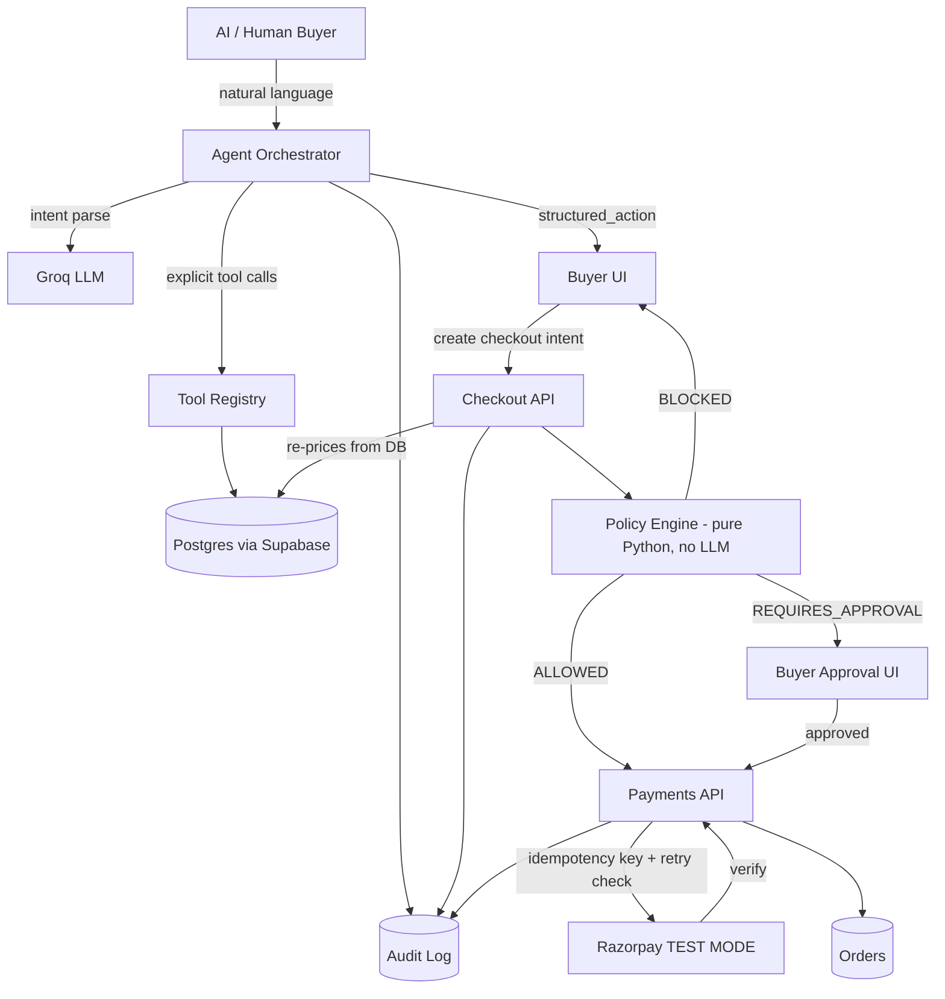

# AURA Commerce

**Commerce built for the age of AI buyers.**

A production-style SaaS platform for the Razorpay Agentic Commerce hackathon track. Merchants
publish an AI-readable catalog; an AI shopping assistant understands buyer intent, recommends
and upsells, and every rupee that moves is gated by a deterministic guardrail engine, approved
by the buyer when required, and logged to a full audit trail — all settled through Razorpay
**TEST MODE**.

## Problem

Autonomous AI agents are starting to shop on behalf of people, but most storefronts are built
for human eyes and human trust decisions. There's no standard way for a merchant to let an AI
buyer transact safely — explain its reasoning, respect a budget, and never move money without
a human-auditable trail.

## Solution

AURA Commerce gives merchants:
- An AI-readable product catalog
- A conversational AI shopping agent (intent parsing → search → recommend → upsell)
- A **guardrail engine** independent of the LLM that gates every transaction (`ALLOWED` /
  `REQUIRES_APPROVAL` / `BLOCKED`)
- Razorpay TEST MODE checkout, idempotency-keyed and retry-bounded
- A complete, explainable audit trail of every AI and financial action

## Architecture



**Architecture invariant enforced throughout the codebase:**

```
LLM -> structured action -> validation -> Policy Engine -> permission check -> backend action -> Razorpay
```

The LLM never has a payment tool. `app/payments/razorpay_client.py` is the only module that
imports the Razorpay SDK, and it is never imported from `app/agents/`.

## Tech stack

| Layer | Choice |
|---|---|
| Frontend | React + Vite + TypeScript + Tailwind + TanStack Query + Recharts |
| Backend | FastAPI + Pydantic + SQLAlchemy |
| Database / Auth | Supabase Postgres + Supabase Auth |
| AI | Groq (swappable via `app/services/ai_provider.py`) |
| Payments | Razorpay TEST MODE |
| Deployment | Frontend -> Vercel/Netlify, Backend -> Render, DB -> Supabase |

## Features

- Merchant onboarding (business -> commerce -> AI agent -> safety policies)
- AI-readable product catalog with upsell/cross-sell relationships and product images
- Conversational AI buyer interface with live cart (add/remove), policy decision panel, and
  an itemized order receipt after payment
- Deterministic policy engine (12 unit tests, `backend/tests/test_policy_engine.py`)
- AI orchestration tested against a scripted fake provider (11 tests,
  `backend/tests/test_agent_orchestration.py`) — covers hallucinated product IDs, invalid
  upsell/cross-sell relationships, and disabled-feature suppression
- Razorpay TEST MODE checkout via `useRazorpayCheckout` hook
- Idempotency-keyed payment attempts, retry-limit enforcement, graceful failure handling
- Full audit trail (merchant dashboard `/dashboard/audit`)
- Analytics: AI GMV, conversion, AOV, upsells/cross-sells, revenue-over-time chart,
  per-product performance breakdown
- Storefront share link on the dashboard (copy-to-clipboard)
- Agent Playground for merchants to test their agent's reasoning and tool calls
- Demo Mode with four scripted scenarios: success, approval-required, blocked, payment-failure
- Robust dual-mode Supabase JWT verification (works with both legacy static-secret and
  newer JWKS-based signing, auto-detected)

## Guardrail architecture

`backend/app/policies/engine.py` is pure Python with zero database or LLM dependency. It takes
a merchant's `Policy` config and a proposed transaction, and deterministically returns
`ALLOWED`, `REQUIRES_APPROVAL`, or `BLOCKED` with a human-readable reason and a per-check trace.
Checks run in this order, short-circuiting on the first failure:

1. Hard transaction cap
2. Buyer-stated budget
3. Upsell ceiling
4. Discount ceiling
5. Retry ceiling
6. Approval threshold

## Payment flow

```
AI recommendation -> Cart -> Policy validation -> Buyer approval (if required)
  -> Checkout intent (server-re-priced) -> Razorpay order created (idempotency key)
  -> Razorpay TEST payment -> Signature verification -> Order created/updated -> Audit event
```

Retries are capped by `max_automatic_retries`. Once the limit is hit, the retry is blocked by
the same policy engine used for money decisions, and the buyer sees:
*"Retry was not attempted because the configured retry limit has already been reached.
No duplicate payment was created."*

## Database schema (core tables)

`merchants`, `agent_configs`, `policies`, `products`, `agent_sessions`, `agent_messages`,
`checkout_intents`, `orders`, `payment_attempts`, `audit_events`. See `backend/app/models/`.

## API documentation

Interactive docs at `http://localhost:8000/docs` once the backend is running. Key endpoints:

| Method | Path | Purpose |
|---|---|---|
| POST | `/merchants` | Create merchant profile (auth required) |
| GET/PUT | `/merchants/me/policy` | Guardrail configuration |
| GET/POST/PUT/DELETE | `/products` | Catalog CRUD (auth required) |
| POST | `/agent/chat` | Buyer-facing AI shopping turn (public) |
| POST | `/checkout/intent` | Create + policy-evaluate a checkout |
| POST | `/checkout/approve` | Buyer approval decision |
| POST | `/payments/create` | Create Razorpay test order (idempotent) |
| POST | `/payments/verify` | Verify signature, finalize order |
| GET | `/orders` | Merchant order list (auth required) |
| GET | `/audit` | Full audit trail (auth required) |
| GET | `/analytics/summary` | Dashboard metrics (auth required) |

## Local setup

### Backend

```bash
cd backend
python3 -m venv venv && source venv/bin/activate
pip install -r requirements.txt
cp .env.example .env   # fill in Supabase / Groq / Razorpay keys
python3 -m uvicorn app.main:app --reload
```

Dev convenience: without `DATABASE_URL` set, the backend falls back to a local SQLite file
(`dev.db`) and auto-creates tables on startup. Production should point `DATABASE_URL` at
Supabase Postgres and use Alembic migrations instead of `create_all`.

### Seed demo data

```bash
cd backend
python3 ../database/seed.py
```

Prints a demo merchant ID — use it for `/buyer/<id>` and the Agent Playground.

### Frontend

```bash
cd frontend
npm install
cp .env.example .env   # set VITE_API_URL, VITE_SUPABASE_URL, VITE_SUPABASE_ANON_KEY
npm run dev
```

### Tests

```bash
cd backend
PYTHONPATH=. pytest tests/ -v
```

## Environment variables

See `backend/.env.example` and `frontend/.env.example`. Never commit real keys. Razorpay keys
must be **TEST MODE** (`rzp_test_...`) — this build never processes real payments.

## Deployment

- **Frontend**: `npm run build` -> deploy `frontend/dist` to Vercel or Netlify
- **Backend**: deploy `backend/` to Render (Python 3.11+, start command
  `uvicorn app.main:app --host 0.0.0.0 --port $PORT`)
- **Database**: Supabase project, run migrations, set `DATABASE_URL` to the pooled connection string

## Demo flow

1. Open `/demo`, enter the seeded merchant ID
2. **Run successful purchase** — birthday gift under ₹1500, ALLOWED, Razorpay test payment, order confirmed
3. **Run approval-required transaction** — cart above threshold, buyer approves, payment proceeds
4. **Run blocked transaction** — cart above hard cap, no payment attempted
5. **Run payment failure** — simulated decline, retry policy checked, duplicate payment prevented
6. Open `/dashboard/audit` to show the complete, explainable trail for all four runs

## Security

- All secrets via environment variables, never hardcoded, never sent to frontend
- Supabase JWT verified server-side for every merchant-authed route
- LLM has no database access and no payment tool — only explicit, validated functions in
  `app/agents/tools.py`
- All checkout totals re-priced server-side from the database, never trusted from client/AI input
- Idempotency keys prevent duplicate orders and duplicate payment attempts
- Unhandled exceptions return a generic message, never a raw stack trace

## Limitations

- No webhook listener for async Razorpay events — verification is synchronous via the client SDK
- Single AI provider (Groq) implemented; the abstraction supports adding more
- Rate limiting is keyed by client IP, naive behind a load balancer in production

## Future roadmap

- Webhook-based payment reconciliation
- Multi-turn cart editing beyond add/remove (e.g. "swap the gift wrap for a card")
- Merchant-configurable upsell/cross-sell rules UI (currently seed-script or manual DB only)
- Role-based team access for merchant accounts
- Multi-image product galleries (currently one image per product)
